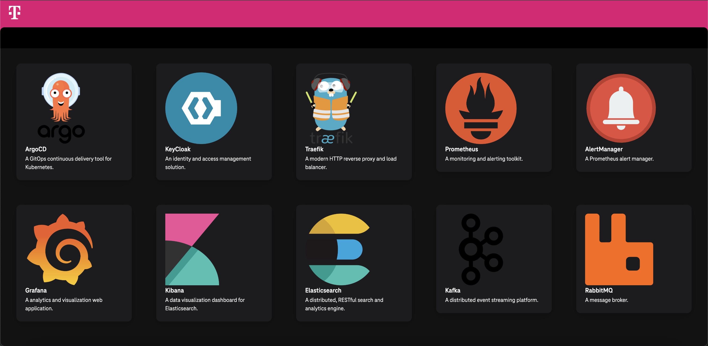

# Telekom-Project-Launchpad


> [!NOTE]
> This project can be used to navigate to other services of Deutsche Telekom. 
> It is a simple project that uses React, TypeScript, Vite, and TailwindCSS.

```shell
npm install
npm run dev
```

# Docker
```shell
docker build -t telekom-project-launchpad .
docker run -p 5173:5173 telekom-project-launchpad
```
